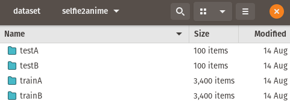
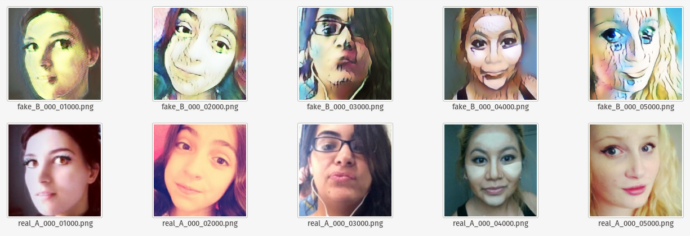
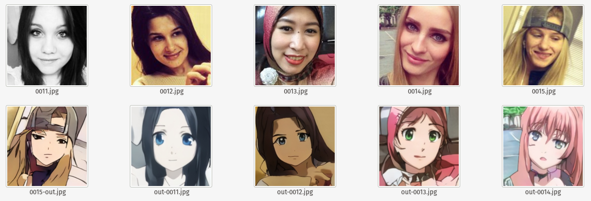
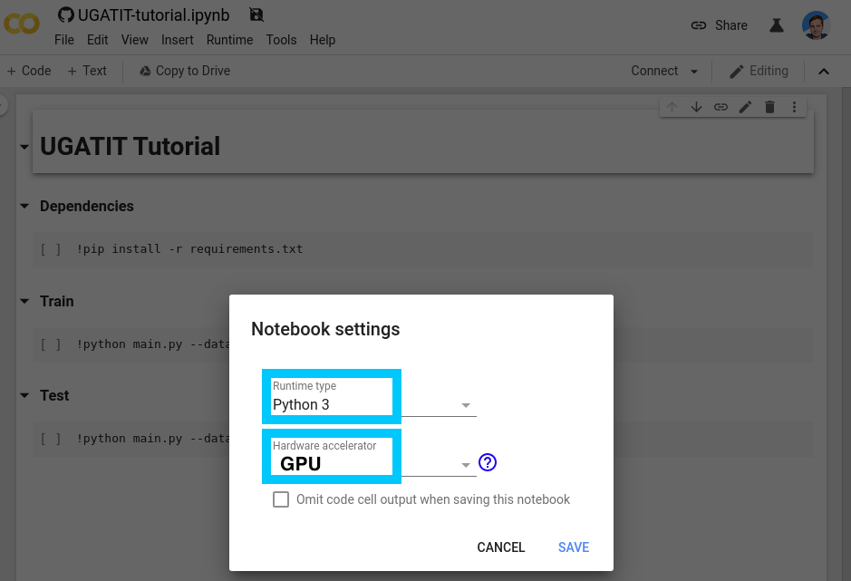

# Building your own UGATIT Model

[Selfie2Anime](https://selfie2anime.com/) was a successful use of Image-to-Image translation using [UGATIT](https://github.com/taki0112/UGATIT); a project by Junho Kim, Minjae Kim, Hyeonwoo Kang and Kwanghee Lee. This however isn't the only combination of images that could be swapped. The combinations are literally limitless, and in this post I'd like to describe how you can create your very own alternate variation.

The work that's required to train your own version of this project is described at a high level below:

* [Development Environment Setup](#Development-Environment-Setup)
* [Dataset Collection & Preparation](#Dataset-Collection-&-Preparation)
* [Model Training](#Model-Training)
* [Model Inference](#Model-Inference)
* [Running in the Cloud](#Running-in-the-cloud)
  * [Google Colab (Inference Only)](#Google-Colab)
  * [AWS SageMaker](#AWS-SageMaker)
  * [Google AI Platform Notebooks](#Google-AI-Platform-Notebooks)

---

## Development Environment Setup

---

### Base Requirements

You should be able to make use of either AWS SageMaker or Google Colab, however for people who are planning on training or performing inference locally the following requirements are good to have setup

* Clone the tutorial respository at [https://github.com/t04glovern/x2x-tutorial](https://github.com/t04glovern/x2x-tutorial)
* [AWS CLI Setup](https://aws.amazon.com/cli/) and authenticated with an account (Optional)
* [GCP SDK Setup](https://cloud.google.com/sdk/) and authenticated with a project (Optional)
* Python Environment:
  * Anaconda is highly recommended. For more information on setup, checkout my post on [Repeatable Data Science - Anaconda Environments](https://devopstar.com/2019/07/29/repeatable-data-science-anaconda-environments/)
  * Alternatively Pip with Python3.5 is advisable
* **CUDA GPU is required** for this tutorial.
  * tensorflow-gpu will be installed as part of dependencies.
  * Inference *should* work on CPU however training will not.
* [Docker Community](https://docs.docker.com/install/) is also recommended a container deployment sounds awesome to you.

### Requirement Install

The following steps cover each of the different variations of development environments you might be working with.

#### Local Environment [Requirements]

If you are running locally open up a shell and run one of the following sets of commands.

**NOTE**: *Depending on if you decided to use Anaconda or not will define what commands to use*

```bash
# Anaconda
conda env create -f environment.yml
conda activate UGATIT

# Pip / Python3.5
pip3 install --upgrade pip
pip3 install -r requirements.txt
```

---

## Dataset Collection & Preparation

---

Collecting and preparing datasets for use is the most difficult part of this project. Let's take a look at what was used for the training of selfie2anime created with UGATIT:

* **selfie2anime**
  * selfie - photos of females as training data and test data. The size of the training dataset is 3400, and that of the test dataset is 100, with the image size of 256 x 256.
  * anime - selecting only female character images and removing monochrome images manually, collected two datasets of female anime face images, with the sizes of 3400 and 100 for training and test data respectively
    * made use of [nagadomi/lbpcascade_animeface](https://github.com/nagadomi/lbpcascade_animeface) to extract the faces
* **horse2zebra**
  * training - 1,067 (horse), 1,334 (zebra)
  * test - 120 (horse), 140 (zebra)
* **photo2portrait**
  * training - 6,452 (photo), and 1,811 (vangogh)
  * test - 751 (photo), and 400 (vangogh)

This gives us a lot of information about roughly how much data we should compile to get reasonably successful results.

### Dataset Folder Structure

The datasets you decide to use should be put into the `dataset` folder of the project and follow the structure seen below

```bash
├── dataset
   └── DATASET_NAME
       ├── trainA
           ├── xxx.jpg (name, format does not matter)
           ├── yyy.png
           └── ...
       ├── trainB
           ├── zzz.jpg
           ├── www.png
           └── ...
       ├── testA
           ├── aaa.jpg
           ├── bbb.png
           └── ...
       └── testB
           ├── ccc.jpg
           ├── ddd.png
           └── ...
```

**You need to ensure that images are cropped down** to an appropriate size before using them. To do this programmatically, edit `resize.py` and ensure the DATASET_NAME matches your one

```python
paths = [
    "dataset/DATASET_NAME/testA/"
    "dataset/DATASET_NAME/testB/"
    "dataset/DATASET_NAME/trainA/"
    "dataset/DATASET_NAME/trainB/"
]
```

Once you have images in the four folders above you can run the following python file to resize all the images down to 256*256

```python
python resize.py
```

### Selfie2Anime Example

Let's walk through an example of how the datsets for selfie2anime was compiled. We needed two datasets:

**NOTE**: *I can't directly provide these datasets to use for Licensing reasons, however you are able to download them yourself from the links*.

* Selfie Dataset - [https://www.crcv.ucf.edu/data/Selfie](https://www.crcv.ucf.edu/data/Selfie)
* Anime Dataset - [https://www.gwern.net/Danbooru2018](https://www.gwern.net/Danbooru2018)

These datasets are much bigger then was necessary so a portion of each were taken for each.

**NOTE**: An important thing to keep in mind is that only female anime characters were used. This means a lot of hand picked items had to be singled out. When deciding on what to use in your dataset ensure there's some level of consistency.



---

## Model Training

---

We should now be in a good position to begin training out model. **This process is very time consuming** but rewarding.

To begin training the model we can run the following command:

```bash
python main.py \
    --dataset YOUR_DATASET_NAME \
    --phase train \
    --light True
```

**NOTE**: *Including the `light` flag is really important here, as the algorithm was built to run on a very powerful system with lots of video memory. I'm certain that you'll not have the requirements to train without `light` however feel free to try.*

There are a variety of different parameters that can also be passed in. They can be found at the top of `main.py`; however I've pasted a couple important ones below

```python
parser.add_argument('--phase',      default='train',        help='[train / test]')
parser.add_argument('--light',      default=False,          help='[full version / light version]')
parser.add_argument('--dataset',    default='selfie2anime', help='dataset_name')
parser.add_argument('--epoch',      default=100,            help='The number of epochs to run')
parser.add_argument('--iteration',  default=10000,          help='The number of training iterations')
parser.add_argument('--batch_size', default=1,              help='The size of batch size')
parser.add_argument('--print_freq', default=1000,           help='The number of image_print_freq')
parser.add_argument('--save_freq',  default=1000,           help='The number of ckpt_save_freq')
parser.add_argument('--decay_flag', default=True,           help='The decay_flag')
parser.add_argument('--decay_epoch',default=50,             help='decay epoch')
```

Training should begin after a short period of time. You should see an output line the following indicating that the process is running.

```bash
# Total bytes of variables: 536148544
#  [*] Reading checkpoints...
#  [*] Failed to find a checkpoint
#  [!] Load failed...
# Epoch: [ 0] [    0/10000] time: 36.7933 d_loss: 10.07452965, g_loss: 4296.04980469
# Epoch: [ 0] [    1/10000] time: 37.4076 d_loss: 8.61443043, g_loss: 3150.35839844
# Epoch: [ 0] [    2/10000] time: 38.0224 d_loss: 8.07216549, g_loss: 3547.32763672
# Epoch: [ 0] [    3/10000] time: 38.6383 d_loss: 8.33526993, g_loss: 2290.56347656
# Epoch: [ 0] [    4/10000] time: 39.2726 d_loss: 7.67077017, g_loss: 2063.63549805
# Epoch: [ 0] [    5/10000] time: 39.9149 d_loss: 7.70433044, g_loss: 2031.88806152
# Epoch: [ 0] [    6/10000] time: 40.5567 d_loss: 7.72997952, g_loss: 1928.70324707
# Epoch: [ 0] [    7/10000] time: 41.2098 d_loss: 7.84641171, g_loss: 2091.36791992
# Epoch: [ 0] [    8/10000] time: 41.8431 d_loss: 8.77949142, g_loss: 2413.52807617
# Epoch: [ 0] [    9/10000] time: 42.4762 d_loss: 8.61334419, g_loss: 2224.50952148
# Epoch: [ 0] [   10/10000] time: 43.1270 d_loss: 8.99942780, g_loss: 2308.36425781
# Epoch: [ 0] [   11/10000] time: 43.7578 d_loss: 8.61170959, g_loss: 2720.20214844
# Epoch: [ 0] [   12/10000] time: 44.3873 d_loss: 8.42855263, g_loss: 2132.31250000
# Epoch: [ 0] [   13/10000] time: 45.0359 d_loss: 8.33146286, g_loss: 1888.32006836
```

After each 100 interations, UGATIT will generate some samples that can be viewed in the `samples` folder. Obviously initial results aren't going to be fantastic, however the samples allows you to view progress while the training occurs.



With the settings above a checkpoint is created every 1000 iterations as well. A checkpoint is a state that inference can be performed on, or resumed from.

### Resume Training

If you need to resume training, or potentially you'd like to try transfer learning and continuing to train an existing model; then the process of resuming training is very simple.

Re-run the training command with the same parameters as before. You'll notice that if you change parameters then the folder name within the `checkpoint`, `samples`, `results` and `logs` folder all change.

Example of light vs non-light training:

* **Light** - UGATIT_light_selfie2anime_lsgan_4resblock_6dis_1_1_10_10_1000_sn_smoothing
* **Non-Light** - UGATIT_selfie2anime_lsgan_4resblock_6dis_1_1_10_10_1000_sn_smoothing

**NOTE**: *You can obviously get around this by just copying in the existing checkpoint files to the new folder (with new parameters) if you need to.*

---

## Model Inference

---

Lets pretend you've spent a bunch of time training your model and now you'd like to perform interence against it. The process for doing this can be kicked off with a commmand similar to the one below:

```bash
python main.py \
    --dataset YOUR_DATASET_NAME \
    --phase test \
    --light True
```

Your parameters are going to define which folder will be checked for a matching checkpoint, so ensure its the same as your training parameters.

The `test` will use the images in the `dataset/DATASET_NAME/testA` and `testB` folders.

### Selfie to Anime at 100 Epochs



### Anime to Selfie at 100 Epochs


## Running in the Cloud

For people who haven't got access to a desktop system or server with a GPU, then there are a couple other options that are available to you.

* [AWS SageMaker](https://aws.amazon.com/sagemaker/)
* [Google AI Platform Notebooks](https://cloud.google.com/ai-platform-notebooks/)
* [Google Colab](https://colab.research.google.com)

Let's walk through how you can use either of these two solutions for training and running inference.

### Google Colab (Inference Only)

Google Colab is the easist to get started with however it's likely only going to be useful for inference. This is because it's designed for prototyping and the GPU/TPU that is attached to the instance might not always be around. This isn't preferable given we want to train for long periods of time.

To open the sample notebook.ipynb, open the following:

[](https://colab.research.google.com/github/t04glovern/selfie2anime-tutorial/blob/master/notebook.ipynb)

Confirm that the runtime is setup as `Python 3` and when you are ready to train / test, also add a TPU.



### AWS SageMaker

TODO

### Google AI Platform Notebooks

TODO
